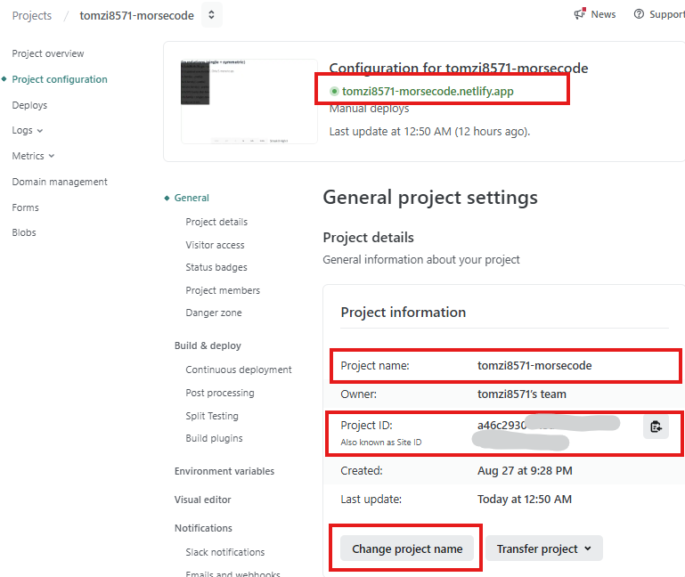

# Fun with morse code

<!-- TOC -->
* [Fun with morse code](#fun-with-morse-code)
  * [Getting Started](#getting-started)
  * [How it works](#how-it-works)
  * [The story behind this project...](#the-story-behind-this-project)
  * [Deployment to Netlify](#deployment-to-netlify)
    * [Deploy snapshot to netlify](#deploy-snapshot-to-netlify)
  * [Deploy to Github Pages](#deploy-to-github-pages)
* [Release Notes](#release-notes)
<!-- TOC -->

## Getting Started
As of now, the project has been deployed to Netlify and Github Pages 
- https://morsely.netlify.app/
- https://tomzi8571.github.io/morsely/

## How it works
Well, you simple start by learning one letter at a time. First we start with 'e'. You see the morse code for e - '.'. You type 'e'. Well done! Next you see '-', you type 't'. Now you get a couple of words with only 't' and 'e'. Next 'i'. Letters are added and in every progression, you get words and sentences with only letters you just learned. 

For motivation you can get on your personal highscore. It measures your longest streak you have so far. 

## The story behind this project...

I just started learning react in Aug 2025 with
this [udemy course](https://www.udemy.com/course/spring-boot-using-intellij-build-a-real-world-project/).
While doing this course I got carried away, developing my own makeshift *React* only app. Something that existed already
for sure - somewhere out there. But I didn't even bother to look around to see what exists already, but just wanted to
try myself. Short background story: Since I was a kid, I always wanted to
learn morse code. As a preteen I started with it from one of those magazines that encourages survival skills, doing
knods ... and using morsecode with your torch. Even as a child I thought, that it would be great to learn morse code
from examples, or to morse code with friends :) I thought about it through the years, writing a program, that
would actually help me to learn morse code from lots of examples. Back in school I had a
little programmable [SHARP 1401](https://de.wikipedia.org/wiki/Sharp_PC-1401) in school, I wrote a lot of BASIC
programs,
mostly for maths to calculate complex numbers, to the dismay of our teacher 😉. But I never got around to work on this
morse program. And now, 45 years later I still thought about it - isn't that something - some thoughts or ideas never  
seem to let you go. So, finally I sat down to scratch this itch while learning react 😂.

Within 2 days I got a working starter running. I used a lot of AI support in IntelliJ, to help me mostly with annoying
react errors and CSS
styling issues for the mobile view. I also asked it to create a json with different excercises to learn morse could. I
must say it did a
pretty amazing (scary) job with to get a starting point. I had major problems making the UI work for the mobile view,
especially to create a non-scrollable single page view that also takes the opening keyboard on the smartphone into
account.
It took me a lot of frustrating routes, trying different height properties, like 100svh instead of 100% and javascript
to calculate the viewport... but hopefully I
The UI was not good, but I was learning 😉 and it was mostly about the functionality, back then.
I hope I figured it out, today, as you read this right now 😉

## Deployment to Netlify

1. Setup the project in [Netlify](https://www.netlify.com/). This should be straight forward.

2. Rename the project to get a better URL.

   

3. Deploying from commandline for the first time. 

    There is a detailed description here:
    [Get started with Netlify CLI](https://docs.netlify.com/api-and-cli-guides/cli-guides/get-started-with-cli/)  
    But I used this link, with that it only involved 3 steps: [Publishing your site assets with the Netlify CLI](https://www.netlify.com/blog/2021/12/01/publish-your-site-assets-with-the-netlify-cli/)
    
    The process below describes how you deploy to the production environment, wbich for me can
    be reached under https://morsely.netlify.app/. But you can also deploy snapshots, which have private Urls (see [below](#deploy-snapshot-to-netlify)) 

    In your project directory (I used the terminal in IntelliJ) execute

    `npm install` (which installs the netlify cli and all other dependencies)

    I wrapped the netlify deployment commands in the package.json. But you can also execute the commands
    directly in the terminal. When you deploy to netlify for you first time, you need to link the project to the netlify
    project. (When I did this for the first time, it asked me to login to netlify and link the project. All as part of the
    first time deployment. If that fails for you for some reason, then run `npx netlify login` and
   `npm run netlify:link` independetly.)

    ```terminaloutput
    npm run deploy:netlify
    ``` 
    (This wraps the `netlify deploy` in the package.json)
  
    I now got a couple of questions in the CLI to link this project to the netlify project:
    After the clicking the link the browser opened, supposedly  to link the netflify project to this project.

    ```terminaloutput
        Logging into your Netlify account...
        Opening https://app.netlify.com/authorize?response_type=ticket&ticket=003ace...
        
        You are now logged into your Netlify account!
        
        Run netlify status for account details
        
        To see all available commands run: netlify help
        
        This folder isn't linked to a project yet
        
        To create and deploy in one go, use: netlify deploy --create-site <SITE_NAME>
    ```
    
    It asked my right away to select between creating a new netflify project or link to an exiting one. I 
    selected the latter
    
   ```terminaloutput
        ? What would you like to do? ⇄  Link this directory to an existing project
        
        Adding local .netlify folder to .gitignore file...
        
        netlify link will connect this folder to a project on Netlify
    ```
    
    Now I had to enter the Project Id in Netlify. You can find in the Netflify Projectdetails (see the Screenshot above)
    
   ```terminaloutput
        ? How do you want to link this folder to a project? Enter a project ID
        ? What is the project ID? 910400aa-8....
        Directory Linked
        
        Admin url: https://app.netlify.com/projects/tomzi8571-morsecode
        Project url:  https://tomzi8571-morsecode.netlify.app
        
        You can now run other `netlify` cli commands in this directory
        
        ....
    ```
    
    And that was it... I typed in

    `npm run deploy:netlify`

    again, it got deployed, just like that. Pretty awesome, right?!Hope that helps someone out there 😊

### Deploy snapshot to netlify
   Snapshots are deployed to  https://<someSnapshotVersion>--morsely.netlify.app

   To do this, just run

   `npm run deploy:netlify:preview`

## Deploy to Github Pages

- Prerequisites
  - Repo is pushed to GitHub and you have write access.
  - If your repository name is not `morsely`, update the GitHub Pages base in `vite.config.js` (mode `gh`): `base: '/<your-repo-name>/'`.

- One‑time setup
  - Install deps: `npm install`
  - After the first deploy (below), in GitHub: Settings → Pages → Source = `gh-pages` branch, `/` (root).

- Deploy
  - Run: `npm run deploy:gh`
  - This builds with `--mode gh`, creates a `404.html` for SPA routing, and publishes `dist` to the `gh-pages` branch.

- URL
  - https://<your-username>.github.io/morsely/
  - Replace with your repo name if different.


# Release Notes
[Release Notes](docs/RELEASE_NOTES.md)